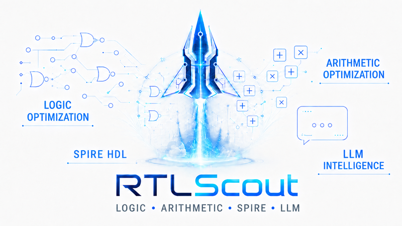

<div align="center">
  
</div>

<br>

# RTL Scout

<p align="center">
  <a href="https://github.com/huawei-csl/rtlscout/actions/workflows/pytest.yml"></a>
  <a href="LICENSE"></a>
  <a href="https://arxiv.org/abs/2606.06530"></a>
  <a href="https://github.com/orgs/huawei-csl/packages/container/package/rtlscout"></a>
  <a href="https://vscode.dev/redirect?url=vscode%3A%2F%2Fms-vscode-remote.remote-containers%2FcloneInVolume%3Furl%3Dhttps%3A%2F%2Fgithub.com%2Fhuawei-csl%2Frtlscout"></a>
</p>

An RTL design agent powered by pluggable LLM backends (DeepInfra, Anthropic) with tool use. The agent iteratively creates and optimizes Verilog/SystemVerilog, Spire or Amaranth designs, targeting **correctness first, then minimal cost** under a configurable cost metric.

## What RTL Scout does

- Generates and optimizes RTL from a specification or a starting design.
- Runs correctness checking with Verilator-based testbenches.
- Evaluates cost with Yosys/ABC, OpenROAD, or AIG-based metrics.
- Supports single-agent runs and multi-run elite-pool optimization.
- Supports Verilog, SpireHDL, and Amaranth design flows.
- Provides scripts to extract best designs, Pareto fronts, and plots.

## Quick start

The fastest way to confirm your setup works — it runs an **offline fake model**, so no API key, provider, or long benchmark is involved.

```bash
git clone --recurse-submodules https://github.com/huawei-csl/rtlscout.git
cd rtlscout
bash .devcontainer/pull_image.sh           # pull the prebuilt EDA image (~3 GB)
bash .devcontainer/start_container.sh      # install deps + drop into the container shell

# inside the container shell:

# smoke test, no API required
python run_benchmark.py --benchmark simple_adder --model fake:simple_adder_pass
python run_eval.py benchmarks/fpmul_f16/context/starting_point.py --benchmark benchmarks/fpmul_f16 --language spirehdl --cost-metric area --target-delay 500

# copy .env
cp .env.template .env
```

**Expected result for run_benchmark.py:** the run finishes **without an API key** and writes results under `runs/` (look for a `Best: PASS` line near the end of the output).

**Expected result for run_eval.py:** it compiles and evaluates the bundled FP16 reference — also **without an API key** (it only evaluates an existing design, no LLM) — printing an `=== Evaluation Result ===` block with `Correctness: PASS` and the design's `area`.

Next, add real API keys to `.env` and pick a workflow from [Choosing an entry point](#choosing-an-entry-point); for the VS Code flow or build-from-source options, see [Installation](#installation-details).

## Requirements

- **Docker** — the EDA toolchain (OpenROAD, Yosys, Verilator, OpenSTA, sv2v) and the Python environment ship as a prebuilt image, so nothing else needs to be installed on the host.
- **Git** with submodule support — the `spire-hdl` submodule is required.
- **~3 GB** of free disk for the prebuilt slim image (~54 GB if you build the full image from source).
- *(optional)* **VS Code** with the Dev Containers extension, for the devcontainer workflow.
- *(for real runs only)* an **LLM provider API key** — DeepInfra, Anthropic, or OpenRouter. Not needed for the quick start above.

## Installation Details

Pick the VS Code devcontainer or a manual Docker setup — both use the same prebuilt EDA image.

### VS Code Dev Container

1. Clone this repo with submodules:
   ```bash
   git clone --recurse-submodules https://github.com/huawei-csl/rtlscout.git
   ```
2. Open the `rtlscout` folder in VS Code.
3. When prompted, click **"Reopen in Container"** (or run the command *Dev Containers: Reopen in Container*).
4. Once the container is up, set the VS Code Python interpreter to `~/pyenv_eda/bin/python` (*Python: Select Interpreter* → enter that path).

The Dev Container extension will **pull the prebuilt image** (the default) and start the environment — or build it from source instead (see *Docker image* below). Edit `.env` with your API keys once inside:
```bash
cp .env.template .env && code .env
```

### Manual Docker setup

```bash
# 1. Clone this repo with submodules
git clone --recurse-submodules https://github.com/huawei-csl/rtlscout.git
cd rtlscout

# 2. Initialize the spire-hdl submodule
bash .devcontainer/setup_workspace.sh

# 3. Edit .env with your API keys (ANTHROPIC_API_KEY, OPENROUTER_API_KEY, etc.)
cp .env.template .env
vi .env

# 4. Get the Docker image — pull the prebuilt slim image (fast; recommended)
bash .devcontainer/pull_image.sh
#    (or build from source: bash .devcontainer/build_image.sh — see "Docker image" below)

# 5. Start the container (mounts repo, installs packages, drops into shell)
bash .devcontainer/start_container.sh
```

### Docker image options

The base EDA image (OpenROAD, Yosys, Verilator, OpenSTA, sv2v, …) is large. The easiest path is to **pull the prebuilt slim image**; building from source is fully supported as an alternative.

- **Prebuilt pull** (default, recommended) — `bash .devcontainer/pull_image.sh`. Pulls `ghcr.io/huawei-csl/rtlscout:slim` (~3 GB) and tags it `rtlscout:latest` (the tag `start_container.sh` and the devcontainer expect). By hand: `docker pull ghcr.io/huawei-csl/rtlscout:slim && docker tag ghcr.io/huawei-csl/rtlscout:slim rtlscout:latest`.
- **Slim self-build** — `BUILD_SLIM=1 bash .devcontainer/build_image.sh`. Builds the same ~3 GB image from source: same toolchain, but drops the OpenROAD build tree and the PDK data the flow never reads (uses `deps/tech_eval/.devcontainer/Dockerfile.slim`; shares the full build's compile cache).
- **Full self-build** — `bash .devcontainer/build_image.sh`. Builds everything from source (~1–2 h the first time; ~54 GB image).

The VS Code devcontainer pulls by default; to self-build instead, edit `initializeCommand` in `.devcontainer/devcontainer.json`.

## Benchmarks

Each benchmark is a directory under `benchmarks/`, and directories can be nested in subfolders for grouping — for example the RTLRewriter cases under `benchmarks/dr_rtl/` (referenced as `--benchmark dr_rtl/<case>`). A few of the bundled benchmarks:

- `simple_adder`, `simple_mux`, `alu8` — small logic warm-ups
- `seq_detector`, `fifo_sync4` — sequential designs (FSM, FIFO)
- `fpmul_f16`, `fpadd_f16` — floating-point (SpireHDL)
- `mult8`, `mult4` — arithmetic units

When a benchmark ships a starting-point design under `context/` (e.g. `fpmul_f16`'s `starting_point.py`), run it with the `--language` that matches that file: `spirehdl` for a `.py` SpireHDL source, `verilog` for a `.v`, `amaranth` for an Amaranth design.

Browse `benchmarks/` for the full set; to add your own, see **[README_add_benchmarks.md](README_add_benchmarks.md)**.

## Choosing an entry point

| Goal | Command | Use when |
|------|---------|----------|
| Evaluate an existing design | `run_eval.py` | You already have Verilog/SpireHDL/Amaranth and want correctness + cost |
| Run one agent | `run_benchmark.py` | Debugging or trying one benchmark/model |
| Run many agents with an elite pool | `run_multirun.py` | Optimizing one objective more seriously |
| Build an area-delay Pareto front | `run_pipeline.py` | Best results, but token-heavy and slow |
| Reproduce FP paper experiments | [`README_fpmul.md`](README_fpmul.md) | Specialized `fpmul_f16` / `fpadd_f16` pipeline |

Each is detailed in [Running benchmarks](#running-benchmarks) below.

## Running benchmarks

> Every command here drives an LLM provider, so set your API token in `.env` first (`DEEPINFRA_API_KEY`, `ANTHROPIC_API_KEY`, `OPENROUTER_API_KEY`, …) — see [Installation](#installation-details). The `--model` argument always uses **`provider:model`** syntax; providers are `deepinfra`, `anthropic`, `openrouter` (and `fake` for offline testing).

The examples use `fpmul_f16`, but any directory under `benchmarks/` works — swap the benchmark, model, and cost metric for yours.

### Single run — `run_benchmark.py`

One agent works a single benchmark for a step budget and reports the best design it finds.

```bash
python run_benchmark.py \
    --benchmark fpmul_f16 \
    --model openrouter:qwen/qwen3.7-max \
    --cost-metric transistors \
    --language spirehdl
```

#### SpireHDL optimization-guidance flags

These flags (all **SpireHDL-only** — Verilog/Amaranth runs ignore them) opt the agent into extra synthesis-aware guidance in its system prompt. They're off by default; turn them on for later-stage polishing once a correct structural design exists. The same flags are accepted by `run_multirun.py` and (via the phase machinery) `run_pipeline.py`.

- `--abc-optimize` — adds **`@abc_optimized`** guidance: the agent may wrap combinational logic with the decorator that runs an ABC logic-synthesis script over it.
- `--arith-autoconfig` — adds **`replace_arithmetic_ops()` / `@arithmetic_optimized`** guidance: the agent may reconfigure how `*`/`+`/etc. are implemented (multiplier/adder architecture) instead of leaving them to the default operator mapping.
- `--fsm-optimize` — adds **FSM / state-encoding** guidance (the `State` API plus the `optimized_fsm` / `optimized_encoding` wrappers), letting the agent explore alternative state encodings for sequential designs.
- `--dont-touch-main-arith` — the inverse guard: tells the agent **not** to modify the core `MultiplierConfig` / `AdderConfig`, useful when you want to sweep everything *except* the main arithmetic blocks.
- `--flowy-optimize` — adds `@flowy_optimized` (Mockturtle) guidance; note Mockturtle is not installed in the default image, so this is only useful in a flowy-enabled environment.

### Multirun campaign — `run_multirun.py`

Many agents run in parallel sharing an **elite pool**: some start fresh (exploration), the rest are seeded from the best designs found so far (exploitation). This is the core optimizer and reliably beats single runs on a given objective. See **[README_multirun.md](README_multirun.md)** for the full set of knobs — elite-pool sizing, the fresh schedule, seeding formats, and per-campaign plotting.

```bash
python run_multirun.py \
    --benchmark fpmul_f16 \
    --model openrouter:qwen/qwen3.7-max \
    --total-runs 10 --max-concurrent 4 --max-steps 30 \
    --cost-metric area --language spirehdl
```

### Pipeline — `run_pipeline.py`

Chains two phases of multirun campaigns and combines everything into a single Pareto front:

- **Phase 1** — structural exploration, one campaign per cost metric, no synthesis decorators.
- **Phase 2** — synthesis-aware polish: each campaign is *seeded* from the matching Phase-1 elite pool and run as pure exploitation. For SpireHDL the agent additionally gets `@arithmetic_optimized` and `@abc_optimized`.
- **Pareto** — the Pareto-optimal designs across all campaigns, written to `pareto_fronts/<benchmark>/`.

Running a campaign for **both** `area` and `delay` (the default `--metrics area,delay`) and combining them produces the area-vs-delay front — the **area + speed** workflow that a single `--cost-metric` run can't give you.

```bash
python run_pipeline.py \
    --benchmark fpmul_f16 \
    --model openrouter:qwen/qwen3.7-max \
    --metrics area,delay \
    --total-runs 8 --max-concurrent 4 --max-steps 20 \
    --language spirehdl
```

- `--metrics area` runs a single objective; `--no-phase2` stops after Phase 1.
- `--fsm-optimize` adds FSM / state-encoding guidance (SpireHDL); `--dont-touch-main-arith` freezes configurable multiplier/adder configs (`MultiplierConfig` / `AdderConfig`).
- `--target-delay` (ps) sets the synthesis timing constraint for PPA metrics — lower pushes toward faster logic at the cost of area (typical range 200–2000).
- `--dry-run` prints the exact `run_multirun.py` and `extract_pareto.py` commands the pipeline would run, so you can drive the phases by hand. On completion it also prints the `plot_pareto_paper.py` command to chart the front.

> **Note:** This is the *general* (less specialized) workflow. The FP-specialized **4-phase** pipeline (arithmetic-architecture sweep + high-effort Mockturtle refinement) is documented separately in **[README_fpmul.md](README_fpmul.md)**.

See the [Usage](#usage) section for more command examples.

## Agent flow

```
                        ┌──────────────────────┐
                        │   System prompt      │
                        │  (spec + cost metric │
                        │   + tool docs)       │
                        └─────────┬────────────┘
                                  │
                                  v
                   ┌──────────────────────────────┐
                   │         LLM generates        │
                   │    response + tool calls     │
                   └──────────────┬───────────────┘
                                  │
              ┌───────────────────┼───────────────────┐
              v                   v                   v
     ┌────────────────┐  ┌───────────────┐  ┌────────────────┐
     │  File tools    │  │ run_evaluation│  │     done       │
     │  create_file   │  │               │  │  (final eval)  │
     │  replace_file  │  │  ┌─────────┐  │  └───────┬────────┘
     │  apply_diff    │  │  │SpireHDL │  │          │
     │  read_file     │  │  │compile  │  │          │
     │  ls            │  │  │(if flag)│  │          v
     └────────┬───────┘  │  └────┬────┘  │    ┌───────────┐
              │          │       v       │    │  Result   │
              │          │  ┌─────────┐  │    │ best_cost │
              │          │  │Verilator│  │    │ best_eval │
              │          │  │lint+sim │  │    └───────────┘
              │          │  └────┬────┘  │
              │          │       v       │
              │          │  ┌─────────┐  │
              │          │  │  Yosys  │  │
              │          │  │  cost   │  │
              │          │  └────┬────┘  │
              │          │       v       │
              │          │  Summary:     │
              │          │  pass/fail +  │
              │          │  cost value   │
              │          └───────┬───────┘
              │                  │
              └─────────┬────────┘
                        │
                        v
               ┌────────────────┐    100% correct     ┌──────────────┐
               │ Tool result    │───& lower cost? ───>│ Track best   │
               │ fed back to LLM│                     │ best_design/ │
               └────────┬───────┘                     └──────────────┘
                        │
                        v
                 ┌────────────────┐
                 │ Next step      │──── until done or max_steps
                 └────────────────┘
```

**Strategy**: the LLM is instructed to (1) build a simple correct design first, (2) run evaluation, (3) once 100% correct, iteratively optimize to reduce the cost metric, reverting if correctness breaks.

## Architecture

```
core/
├── prompts.py       # System prompt builders (Verilog + SpireHDL)
├── correctness.py   # Verilator lint + simulation
├── cost.py          # Pluggable cost metrics (transistors, PPA delay/area/power)
├── evaluation.py    # Combines correctness + cost
├── agent.py         # Tool-use agent (7 tools)
├── llm_client.py    # LLM backends (DeepInfra, Anthropic)
├── benchmarks.py    # Benchmark loading
└── runner.py        # Orchestration (model x benchmark)

benchmarks/          # benchmark suite (one dir per benchmark)
run_benchmark.py     # CLI: single benchmark + model
run_model.py         # CLI: all benchmarks for one model
run_sweep.py         # CLI: multiple models x benchmarks
run_multirun.py      # CLI: async elite-pool multi-run optimisation
run_pipeline.py      # CLI: Phases 1-2 pipeline (multirun campaigns + Pareto)
run_eval.py          # CLI: re-evaluate a design file
plot_results.py      # CLI: plotting at any level
```

### Agent tools

| Tool | Description |
|------|-------------|
| `create_file` | Create a new file |
| `replace_file` | Overwrite an existing file |
| `apply_diff` | Apply a unified diff patch |
| `ls` | List files in working directory |
| `read_file` | Read file contents |
| `run_evaluation` | Run correctness (Verilator) + cost evaluation |
| `done` | Signal completion |

### Evaluation

The `run_evaluation` tool returns both:
- **Correctness**: Verilator lint + simulation against a self-checking testbench (pass/fail per TB_CASE)
- **Cost**: Pluggable metric (see below)

The agent is instructed to get 100% correctness first with a simple design, then iterate to reduce cost. The **best result** is the lowest cost among fully correct designs. The best design's workspace is automatically saved to `best_design/` for later use.

### Equivalence checking (CEC)

Simulation only checks the testbench vectors. For a stronger guarantee, a combinational equivalence check (CEC) verifies that the produced design is *logically* equivalent to a golden reference. It synthesizes both designs to BLIF with Yosys and compares them with `yosys-abc`'s `cec`. When the designs are **not** equivalent, the evaluation is gated to FAIL even if simulation passed.

CEC is **on by default**. The reference comes from a `golden_reference` key in the benchmark's `metadata.json` (a `.v`/`.sv` used directly, or a `.py` compiled to Verilog); benchmarks without that key simply skip the check. Pass `--skip-cec` on any `run_*` entry point to disable it.

```bash
# Re-evaluate the bundled FP16 reference; CEC runs against its golden_reference
python run_eval.py benchmarks/fpmul_f16/context/design.v \
    --benchmark benchmarks/fpmul_f16 --language verilog
# ... prints "CEC: EQUIVALENT" in the result block (~2.5s for this design)

# Disable the check
python run_eval.py ... --skip-cec
```

CEC runs only when correctness already passed, and is fast for the bundled combinational designs — e.g. `fpmul_f16` (16-bit, ~1.9k cells) checks in a couple of seconds.

## Cost metrics

The cost metric is configurable via `--cost-metric`. All metrics follow the same interface (`CostMetric` ABC) and the metric name propagates automatically into system prompts, JSON output, and plot labels.

| Metric | `--cost-metric` | Tool chain | Description |
|--------|-----------------|------------|-------------|
| Transistors | `transistors` (default) | Yosys + ABC | Estimated transistor count via `stat -tech cmos` |
| Yosys cells | `yosys_cells` | Yosys | Cell count after `synth; clean -purge; stat` (technology-independent) |
| Yosys wires | `yosys_wires` | Yosys | Wire count after `synth; clean -purge; stat` (technology-independent) |
| Yosys transistors | `yosys_transistors` | Yosys | Transistor count from the same `synth; clean -purge; stat` pipeline (hierarchy-correct; matches `yosys_cells`/`yosys_wires` on multi-module designs) |
| Delay | `delay` | Yosys + OpenROAD STA | Critical-path delay (ps) |
| Area | `area` | Yosys + OpenROAD STA | Design area (um^2) |
| Power | `power` | Yosys + OpenROAD STA | Total power (W) |
| AIG count | `aig_count` | Yosys + spirehdl/aigverse | Post-optimization AIG AND-node count (`num_gates` = `len(aig.gates())`, i.e. AND nodes only — excludes the constant and primary-input nodes), combinational designs only |
| AIG depth | `aig_depth` | Yosys + spirehdl/aigverse | Post-optimization AIG logic depth (`DepthAig.num_levels()`), combinational designs only |

**Transistors / yosys_cells / yosys_wires / yosys_transistors** use fast Yosys-only flows (technology-independent). The `yosys_cells` / `yosys_wires` / `yosys_transistors` variants skip ABC and instead run `synth; clean -purge; stat` — `clean -purge` drops public-alias buffers that `opt_clean` preserves for debuggability, giving counts that more faithfully reflect the netlist. **Delay/area/power** use the `tech_eval` package which synthesizes against a standard cell library (nangate45) and runs OpenROAD static timing analysis. PPA metrics require designs with a `clk` port. **aig_count / aig_depth** measure the And-Inverter Graph after spirehdl's aigverse optimization (yosys `aigmap` → aigverse); combinational designs only.

For PPA metrics, the `--target-delay` flag (in ps) controls the synthesis timing constraint. Lower values push for faster designs at the expense of area/power.

## Usage

Beyond the three entry points above, these commands cover cost metrics, languages and providers, running across many models, and post-processing of results.

### Using different cost metrics

```bash
# Optimize for area (PPA)
python run_benchmark.py \
  --benchmark fifo_sync4 \
  --cost-metric area \
  --target-delay 500

# Optimize for delay (PPA)
python run_benchmark.py \
  --benchmark alu8 \
  --cost-metric delay \
  --target-delay 300

# Optimize for power (PPA)
python run_benchmark.py \
  --benchmark seq_detector \
  --cost-metric power \
  --target-delay 500
```

### Using SpireHDL

The `--language spirehdl` flag switches the agent from writing Verilog directly to writing Python scripts using the SpireHDL embedded DSL. The framework runs the `.py` file; the script writes Verilog directly via `m.to_verilog_file("design.v")`, and the resulting file is evaluated as usual.

The agent's working directory is on the Python path, so the agent can split logic across multiple `.py` files and use plain imports (e.g. `from helper import build_adder`). The main entry point passed to `run_evaluation` (e.g. `design.py`) is the only file that gets executed by the framework.

```bash
python run_benchmark.py \
  --model openrouter:qwen/qwen3.7-max \
  --benchmark mult8 \
  --language spirehdl \
  --max-steps 65 \
  --cost-metric delay
```

### Using different LLM providers

```bash
# OpenRouter
python run_benchmark.py \
  --benchmark alu8 \
  --model openrouter:qwen/qwen3.7-max

# Anthropic
python run_benchmark.py \
  --benchmark alu8 \
  --model anthropic:claude-sonnet-4-5-20250929

# DeepInfra
python run_benchmark.py \
  --benchmark alu8 \
  --model deepinfra:meta-llama/Llama-3.3-70B-Instruct-Turbo

# Mixed providers in a sweep
python run_sweep.py \
  --models anthropic:claude-sonnet-4-5-20250929 deepinfra:meta-llama/Llama-3.3-70B-Instruct-Turbo
```

### Run all benchmarks for a model

```bash
python run_model.py --model openrouter:qwen/qwen3.7-max
```

Run a subset of benchmarks:

```bash
python run_model.py \
  --model openrouter:qwen/qwen3.7-max \
  --benchmarks simple_adder simple_mux alu8
```

### Sweep across models and benchmarks

```bash
# Sweep with default transistor cost
python run_sweep.py \
  --models deepinfra:meta-llama/Llama-3.3-70B-Instruct-Turbo deepinfra:Qwen/Qwen2.5-72B-Instruct \
  --benchmarks simple_adder simple_mux

# Sweep with area cost
python run_sweep.py \
  --models deepinfra:meta-llama/Llama-3.3-70B-Instruct-Turbo deepinfra:Qwen/Qwen2.5-72B-Instruct \
  --cost-metric area \
  --target-delay 500 \
  --max-steps 20
```

### Saving evaluation snapshots

A workspace snapshot is saved **by default** before each evaluation — the workspace files, the evaluation result, and a summary. Snapshots are stored as `eval_1/`, `eval_2/`, etc. alongside the run's `best_design/` and `result.json`. Each `eval_{i}/` contains:
- `workspace/` — copy of the design files at that step
- `result.json` — full evaluation result (correctness, cost, pass rate)
- `summary.txt` — human-readable evaluation summary

Pass `--dont-save-workspaces` to skip the snapshots and save disk (note: `extract_pareto.py` / `extract_best_designs.py` rely on them):

```bash
python run_benchmark.py \
  --model openrouter:qwen/qwen3.7-max \
  --benchmark mult8 \
  --language spirehdl \
  --max-steps 65 \
  --cost-metric delay \
  --dont-save-workspaces
```

### Re-evaluate a design

Use `run_eval.py` to re-run the evaluation pipeline on an existing design file (e.g. from a previous run). Useful for testing with updated testbenches or different cost metrics.

```bash
# Basic: evaluate a SpireHDL design (language auto-detected from .py extension)
python run_eval.py runs/fpmul_f16/claude-opus-4-6/20260311_140923/best_design/workspace/design.py

# Explicit language + cost metric
python run_eval.py runs/.../workspace/design.py --cost-metric delay --target-delay 500

# Use testbench from the original benchmark directory (e.g. after regenerating test vectors)
python run_eval.py runs/.../best_design/workspace/design.py --benchmark benchmarks/fpmul_f16

# Output as JSON
python run_eval.py runs/.../workspace/design.py --json
```

Flags:
- `--language` — `verilog`, `spirehdl`, or `amaranth` (default: auto-detect from extension)
- `--cost-metric` — any registered metric (`transistors`, `delay`, `area`, `power`)
- `--target-delay` — synthesis timing constraint in ps (default: 500)
- `--top-module` — override top module name (default: auto-detect from `design.v`)
- `--workdir` — override workspace directory (default: parent of design file)
- `--benchmark` — copy `tb.sv` and `vectors.dat` from this benchmark directory into the workspace before evaluation
- `--json` — print result as JSON instead of human-readable summary

### Extract best designs

Extract the top N passing designs from any run directory (multirun or single benchmark), sorted by a chosen metric.

```bash
# Top 5 by cost (default)
python extract_best_designs.py runs/multirun_20260316_143944 -n 5 -o best_5/

# Top 3 sorted by delay
python extract_best_designs.py runs/mult8 -n 3 --sort-by delay -o best_delay/
```

Flags:
- `-n` / `--top` — number of designs to extract (default: 5)
- `-o` / `--output` — output directory (default: `<run_dir>/best_extracted`)
- `--sort-by` — metric to sort by: `cost` (default), `area`, `delay`, `power`

Output includes the design files and a `best_designs.json` manifest linking each file back to its original eval.

### Extract Pareto-optimal designs

Extract designs on the area-vs-delay Pareto front. A design is Pareto-optimal if no other design is strictly better in both area and delay.

```bash
python extract_pareto.py runs/multirun_20260316_143944 -o pareto_front/
```

Flags:
- `-o` / `--output` — output directory (default: `<run_dir>/pareto_front`)

Output includes the design files and a `pareto_front.json` manifest with full PPA metrics.

### Plot results

The plotting script auto-detects the level from the JSON structure. Axis labels and titles adapt to whichever cost metric was used.

```bash
# Benchmark level (step-by-step cost + pass rate)
python plot_results.py --input runs/<benchmark>/<model>/<timestamp>/result.json

# Model level (pass/fail + cost per benchmark)
python plot_results.py --input runs/<dir>/summary_<model>.json

# Sweep level (pass rate heatmap + cost comparison across models)
python plot_results.py --input runs/<dir>/all_results.json
```

Use `--no-accuracy` to hide the pass-rate secondary axis in benchmark plots. Pass rate is instead encoded in bar color (green = 100% correct, yellow = partial, orange = failed), with cross markers and percentage labels for non-passing evaluations:

```bash
python plot_results.py --input runs/.../result.json --no-accuracy
```

Override output directory:

```bash
python plot_results.py --input runs/sweep/all_results.json --output-dir my_plots/
```

## Output format

Results are stored as JSON in the `runs/` directory:

- **Benchmark level** (`result.json`): per-step evaluation results, best cost, cost metric name, pass/fail
- **Model level** (`summary_<model>.json`): per-benchmark pass/fail + cost values
- **Sweep level** (`all_results.json`): all model results combined

The best design from each benchmark run is saved in `best_design/` within the run directory, with a `_best_meta.json` file recording the step, cost value, and metric used.

## Adding a benchmark

To add your own benchmark — generated from the spire-hdl arithmetic generators (`add_benchmark.py`) or authored by hand (directory layout, `description.txt`, `metadata.json`, `tb.sv`, `context/`) — see **[README_add_benchmarks.md](README_add_benchmarks.md)**.

**Using Claude Code?** This repo ships an `add-benchmark` skill ([`.claude/skills/add-benchmark/SKILL.md`](.claude/skills/add-benchmark/SKILL.md)) that walks Claude through the process — choosing scope (single design vs. suite) and target language, porting an existing Verilog/SpireHDL design, the testbench contract, and offline + (optional, cost-gated) live verification. Open Claude Code in the repo and invoke it explicitly, passing your design, e.g.:

```text
/add-benchmark Add foo.v as a new benchmark named "foo" (target language: spirehdl)
```

The leading `/add-benchmark` loads the skill explicitly; everything after it is your instruction. (Simply describing the task without the slash also works — Claude picks the skill up automatically.)

## Adding a custom cost metric

Subclass `CostMetric` in `cost.py`:

```python
from core.cost import CostMetric, CostResult

class MyCost(CostMetric):
    @property
    def metric_name(self) -> str:
        return "my_metric"

    def evaluate(self, workdir, top_module=None) -> CostResult:
        # Your evaluation logic here
        return CostResult(ok=True, value=42.0, stats={})
```

Then register it in `COST_METRICS` and `make_cost_metric()`, or pass it directly to `RTLAgent(cost_metric=MyCost())`.

## Paper Experiments

The paper builds designs with a multi-phase optimization pipeline (up to four phases):

1. **Multi-run agent campaigns** — a multi-run *elite-pool* optimizer runs many agents, each either *fresh* (from the spec) or *seeded* from the best designs so far, with lessons-learned feedback shared between runs. Area- and delay-targeted campaigns together build a Pareto front.
2. **Seeded campaigns with synthesis optimization** — re-run seeded from Phase 1's best designs, with the agent additionally placing optimization decorators it controls (e.g. `@abc_optimized`, and `@arithmetic_optimized` for structural arithmetic).
3. **Arithmetic architecture sweep** *(FP-specialized)* — swaps the core mantissa multiplier / exponent adder for classical structures (Wallace & Dadda trees; Kogge–Stone / Brent–Kung / Sklansky adders; …) across optimization targets.
4. **High-effort gate-level refinement** *(FP-specialized)* — many parallel, high-budget Mockturtle AIG-rewriting passes over the whole design.

**This README focuses on the general, less-specialized workflow — Phases 1–2.** Those two agentic phases apply to arbitrary RTL: in the paper this is exactly how the general (non-floating-point) RTLRewriter benchmarks are handled — the Phase-3 arithmetic sweep is folded into the `@arithmetic_optimized` decorator and Phase 4 is dropped, so the pipeline reduces to Phases 1–2. The runnable version is **[Running benchmarks](#running-benchmarks)** below — `run_pipeline.py` chains both phases (Phase 1 structural, Phase 2 synthesis-aware) over area + delay campaigns.

**For the specialized floating-point pipeline** — the full multi-phase workflow that adds the Phase 3 arithmetic architecture sweep (and, in the paper, the Phase 4 high-effort Mockturtle refinement), as used for `fpmul_f16` / `fpadd_f16` — see **[README_fpmul.md](README_fpmul.md)** (worked end-to-end for `fpmul_f16`).

> **Note:** This repository currently supports the **ABC** synthesis-optimization backend (`@abc_optimized`). Mockturtle-based optimization — the `@mockturtle_optimized` decorator and the Phase 4 high-effort refinement — is **not installed** here.

## Citation

If you use RTL Scout in your research, please cite:

```bibtex
@misc{arnold2026rtlscout,
  title         = {{RTLScout}: Joint Agentic Code and Synthesis Optimization for Efficient Digital Circuits},
  author        = {Felix Arnold and Ryan Amaudruz and Dimitrios Tsaras and Renzo Andri and Lukas Cavigelli},
  year          = {2026},
  eprint        = {2606.06530},
  archivePrefix = {arXiv},
  primaryClass  = {cs.AR},
  doi           = {10.48550/arXiv.2606.06530}
}
```