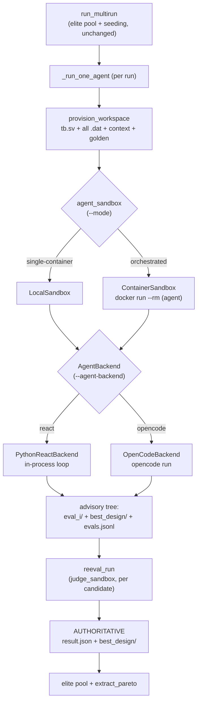
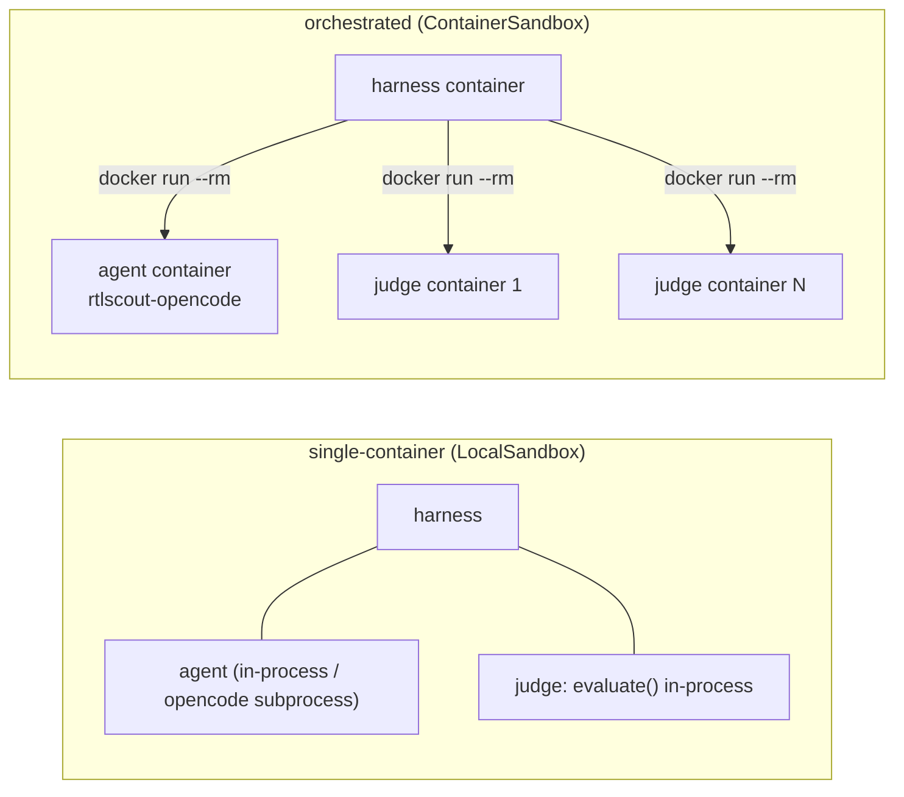
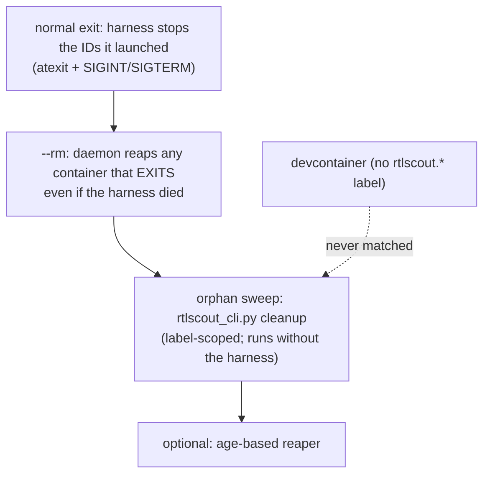

# Agent backends, sandboxing & orchestration

RTLScout runs one optimization **agent per run**. This document covers the two pluggable
seams that let an external coding agent (**OpenCode**) run in its own sandbox alongside the
built-in ReAct loop, the **evaluation-integrity** model that keeps recorded scores
trustworthy even when the agent has a shell, and how to **run + manage** orchestrated,
sandboxed campaigns.

> This is **additive**. The default path (`--agent-backend react --mode single-container`)
> is byte-for-byte the original behaviour; everything here is opt-in.

## TL;DR — the flags

| flag | values | default | meaning |
|---|---|---|---|
| `--agent-backend` | `react` \| `opencode` | `react` | *how* the agent runs (in-process loop vs external OpenCode) |
| `--mode` | `single-container` \| `orchestrated` | `single-container` | *where* work runs (here vs fresh `--rm` containers). **OpenCode only** — `orchestrated` with `--agent-backend react` is rejected |
| `--reeval` | flag | off | force the authoritative re-score on the **react** path too (always on for opencode) |
| `--wall-clock-min` | minutes | `10` | hard per-run budget for the **opencode** agent (`0` = no limit) |

```bash
# default: in-process ReAct, single container (unchanged)
python run_multirun.py --benchmark fpmul_f16 --model openrouter:z-ai/glm-5.2 --total-runs 8

# external OpenCode agent, each run + each judge in its own --rm container
python run_multirun.py --benchmark fpmul_f16 --model openrouter:z-ai/glm-5.2 \
    --agent-backend opencode --mode orchestrated --wall-clock-min 10
```

---

## The two seams

Two orthogonal abstractions, selected by one flag each:

- **`AgentBackend`** (`core/agent_backend.py`) — *how* the agent runs. `--agent-backend`.
  - `PythonReactBackend` — the in-process ReAct loop (`core/agent.py::RTLAgent`). Default;
    capability-confined (no shell); the only backend that can replay the offline `fake:`
    smoke test.
  - `OpenCodeBackend` (`core/opencode_backend.py`) — an external `opencode run` with a real
    shell.
- **`Sandbox`** (`core/sandbox.py`) — *where* work runs, used for **both** the agent and the
  judge. `--mode`.
  - `LocalSandbox` — in the current process/container (single-container).
  - `ContainerSandbox` — a fresh `docker run --rm` per call (orchestrated).



---

## Deployment modes & assurance

The mode picks the `Sandbox` implementation for **both** roles. Assurance is a property of
the mode — don't blur it:

| | single-container | orchestrated |
|---|---|---|
| Harness runs | in the container | on the host / a harness container |
| Agent sandbox | `LocalSandbox` | `ContainerSandbox` (fresh per run) |
| Judge sandbox | `LocalSandbox` | `ContainerSandbox` (fresh per candidate) |
| New containers | none | one per run + one per scored candidate |
| Use case | dev / CI / trusted | sweeps + untrusted/adversarial agents |

- **orchestrated + opencode** → full isolation: a shelled agent in its own container cannot
  reach the judge or the benchmark inputs. Recorded score trustworthy vs an adversarial
  agent. **High-assurance mode.**
- **single-container + react** → also fully trustworthy: react has no shell, so it cannot
  tamper the scorer or its inputs; sharing the container with the judge is fine.
- **single-container + opencode** → **convenience mode, lower assurance.** Agent and judge
  share a container, so a *deliberately malicious* shell could reach the eval code. The
  re-score still defends against accidental tampering + nondeterminism, but it is **not** the
  adversarial-agent guarantee. Dev/CI/trusted only.



---

## Evaluation integrity — advisory vs authoritative (the crux)

A full-shell agent can tamper with its own copy of the scorer/testbench/data. So **the
recorded score is never the number the agent's container produced.** Feedback *during* a run
doesn't need to be trustworthy (it only helps the agent iterate); the *recorded* score does.

| | Agent-side (advisory) | Judge-side (authoritative) |
|---|---|---|
| Purpose | feedback for iteration | the recorded score |
| Trust | untrusted | trusted |
| Inputs | the agent's own (writable) copies | the **benchmark's own** tb.sv + all `*.dat` (+ golden) |
| Implemented by | `run_eval_and_store` (`core/eval_store.py`) | `reeval_run` (`core/reeval.py`) |
| From the agent | everything in its container | **design source only** |

Same `evaluate()`, same args — only the **provenance of the inputs** differs. That delta is
the trust boundary. After the run, the harness re-scores **every** `eval_i/` candidate in a
fresh workspace rebuilt from the benchmark's own inputs, picks `best_design/` from the
authoritative numbers, and feeds those to the pool/Pareto. An **agreement gate** flags any
run where the agent's claim diverges from the re-score (cheating or nondeterminism).

```mermaid
sequenceDiagram
  participant H as Harness (trusted)
  participant A as Agent sandbox (untrusted)
  participant J as Judge sandbox (trusted)
  H->>A: provision full benchmark + AGENTS.md
  A->>A: edit design; run eval shim → advisory eval_i/
  A-->>H: design source + eval_i/ (untrusted numbers)
  loop each candidate
    H->>J: extracted design source + benchmark's OWN inputs
    J->>J: evaluate() → authoritative score
    J-->>H: authoritative result.json
  end
  H->>H: agreement gate; best_design/ + pool/Pareto use AUTHORITATIVE only
```

The judge runs even on the trusted side because `evaluate()` *executes* the agent-authored
SpireHDL `.py` — so every re-score gets a fresh workdir with the benchmark's own inputs +
extracted design only (and, in orchestrated mode, its own `--network none` container).

### When does the authoritative re-eval run?

It is **not** globally always-on — it depends on the backend (and is independent of the mode):

| path | re-eval? | recorded score |
|---|---|---|
| **react, single-container, no `--reeval`** (the original default) | **no** | the agent's in-process number — react has **no shell**, so it can't tamper its own scorer and the number is already authoritative-grade |
| react + `--reeval` | yes | re-derived (apples-to-apples A/B vs opencode) |
| **opencode, single-container** | **yes — in the *same* container** | re-derived; defends against *accidental* tampering / nondeterminism + closes the `run_eval` two-name-overlay hole, but **not** the adversarial guarantee (agent + judge share the container) |
| **opencode, orchestrated** | **yes — fresh `--rm` container per candidate** | re-derived; full adversarial-agent guarantee |

So: the **original react path is unchanged** (no re-eval); the re-eval is **mandatory for
opencode** (a shell ⇒ untrusted container) and **opt-in for react**. Note it runs for opencode
even in single-container — but there the judge shares the agent's container, so for untrusted
or external agents use **orchestrated** mode. (If you fully trust a single-container opencode
agent and want to skip the re-eval for speed, that would be a small added flag — not currently
exposed.)

---

## The OpenCode backend

Per-run lifecycle (`core/opencode_backend.py`):

1. **Provision** the workspace (shared `provision_workspace`).
2. **Render** `AGENTS.md` (the per-language `core/prompts.py` spec + an *OpenCode execution
   section* that overrides the react tool mechanics, documents the `./evaluate_design` eval
   shim, and keeps the four reflection prompts), `opencode.json`, `_eval_config.json`, and an
   executable `evaluate_design` wrapper.
3. **Launch** a **fresh** `opencode run` (no `-c`/`--session`/`--attach` — one run = one
   fresh context). The agent's only way to get a score is `./evaluate_design <file>`, which
   calls `run_eval_and_store` and emits the standard advisory tree.
4. **Harvest** `evals.jsonl` / `eval_i/` / `best_design/` / `summary.txt` into an
   `AgentResult`; snapshot a provenance file + session log.

**Budget (no turn cap):** `--wall-clock-min` is the hard stop (subprocess/container timeout);
the agent is terminated when it's up and nudged to keep going if it stops early.

### Permissions (important — handover §4.8)

OpenCode does **not** sandbox the agent; the container is the boundary. In **non-interactive**
`opencode run`, any permission left at the default **`ask`** is **auto-rejected, and that
aborts the run.** This actually bit us: mid-optimization the agent tried to read the SpireHDL
package source (an `external_directory` access) to explore multiplier architectures, hit an
`ask`, was auto-rejected, and the run ended after 2 evals.

The backend therefore **never leaves a permission at `ask`**:

- **YOLO (isolated sandbox):** when the agent runs in its own `ContainerSandbox` (orchestrated),
  or `RTLSCOUT_OPENCODE_YOLO=1` is set, every permission is `allow` **and** the launch adds
  `--dangerously-skip-permissions`. Safe because the container is disposable and can't reach
  the host/judge.
- **Otherwise (single-container):** every permission is `allow` **except** network
  (`webfetch`/`websearch` → `deny`). Crucially `external_directory` is `allow` so the agent
  can read the installed SpireHDL source. A `deny` returns "denied" and the agent keeps going;
  only an `ask` aborts — and there are none.

This policy is written **per run** into each workspace's `opencode.json` (plus the launch
flag), so it applies to **every freshly-spun orchestrated agent container** automatically — it
is **not** baked into the image.

### Launch quirk

`opencode run` spawns an internal server that fails with a generic *"Unexpected server
error"* when launched as a bare subprocess in `--agent` mode. Launching it via a shell
(`bash -c 'exec opencode run … "$1"' _ <kickoff>`) reliably fixes it (the env is identical
either way — it's the process/session context the server-spawn needs). The kickoff is passed
as `$1` to avoid shell-quoting hazards.

---

## Container image

Orchestrated agent + judge containers use **`rtlscout-opencode:latest`** — a **separate tag**
built `FROM rtlscout:latest` + the pinned OpenCode binary + the Python deps baked in:

```bash
docker build -f .devcontainer/Dockerfile.opencode -t rtlscout-opencode:latest .
```

> **Devcontainer safety:** this never overwrites `rtlscout:latest` (which the VS Code
> devcontainer depends on). One image serves both roles (the judge just ignores the opencode
> binary). It also `chmod -R a+rX /home/vscode` so containers running as the **host uid** can
> use the baked venv.

---

## Container management & cleanup (orchestrated)

**The trap:** `rtlscout:latest` is *also* the devcontainer's image, so any **image-based**
filter would match (and risk killing) the running IDE. Managed containers are therefore
identified **only by a label** the framework stamps and the devcontainer never carries:

```
rtlscout.managed=true        # the authoritative selector
rtlscout.session=<uuid>      # one campaign
rtlscout.role=agent|judge
rtlscout.run=<idx>
rtlscout.started=<epoch>
```

Plus a human name `rtlscout-<role>-<sid8>-<run03>`. Cleanup is label-scoped and additionally
refuses anything carrying `devcontainer.local_folder` (belt-and-suspenders):

```bash
python rtlscout_cli.py list                       # this framework's containers only
python rtlscout_cli.py cleanup [--session <id>]   # graceful stop + remove
python rtlscout_cli.py cleanup --kill             # SIGKILL (panic)
```



### Where to run the harness (and the docker-out-of-docker model)

- **single-container:** the harness runs the agent + judge **in its own process**, so launch
  it **inside a container that already has the toolchain + deps** (`rtlscout` /
  `rtlscout-opencode`), or any environment with them installed. It can't run on the bare host
  (it imports `tech_eval`/`spirehdl`).
- **orchestrated:** the harness launches the agent + judge as **sibling containers on a real
  docker daemon**, so it needs that daemon's socket plus paths that resolve on it. This is
  **docker-*out*-of-docker** (siblings on the host daemon) — **not** a nested daemon
  (docker-in-docker), which is deliberately avoided. So run the harness either:
  - **on the host** — works too, but it's **more setup**: you first have to install the Python
    deps into a host environment (`pip install -e deps/spire-hdl -e deps/tech_eval -r
    requirements.txt`) because the harness imports `tech_eval`/`spirehdl`. (Only the Python
    deps + docker are needed on the host — **not** the EDA toolchain, since `evaluate()` runs
    inside the judge *containers*. The container option below bundles all of that, which is why
    it's the easier, validated path.) **or**
  - **in a container** that bind-mounts the host **docker socket** (`-v
    /var/run/docker.sock:…` + `--group-add <docker gid>`) and the host `docker` CLI, and
    **identity-mounts** the repo (host path == container path) so the host daemon can mount
    the right paths and generated wrappers/configs resolve in both the harness and the spawned
    containers. **This is what the runbook below does** — the harness is itself a container,
    and the agent/judge containers are its *siblings*, not children.

  (So "you must be on the host" isn't strictly true — you must be able to **drive the host's
  daemon**; a socket-mounted container does that fine, which is how it was validated.)

Agent containers use the default `bridge` network (egress to the model provider); judge
containers use `--network none`.

---

## Runbook — the four combinations

```bash
# 0) offline smoke (no API) — default react
python run_benchmark.py --benchmark simple_adder --model fake:simple_adder_pass

# 1) react, single-container, with authoritative re-eval (A/B parity)
python run_multirun.py --benchmark fpmul_f16 --model openrouter:z-ai/glm-5.2 \
    --total-runs 8 --reeval

# 2) opencode, single-container  (run INSIDE an rtlscout-opencode container)
python run_multirun.py --benchmark fpmul_f16 --model openrouter:z-ai/glm-5.2 --language spirehdl \
    --agent-backend opencode --total-runs 1 --wall-clock-min 10 --skip-cec

# 3) opencode, ORCHESTRATED — harness needs an identity mount + the docker socket:
docker run --rm -v "$PWD:$PWD" -v /usr/bin/docker:/usr/bin/docker:ro \
  -v /var/run/docker.sock:/var/run/docker.sock --group-add "$(getent group docker | cut -d: -f3)" \
  --user "$(id -u):$(id -g)" -e HOME=/tmp -w "$PWD" rtlscout-opencode:latest \
  bash -c 'export PATH=/home/vscode/pyenv_eda/bin:/usr/local/bin:$PATH; \
    python run_multirun.py --benchmark fpmul_f16 --model openrouter:z-ai/glm-5.2 --language spirehdl \
      --agent-backend opencode --mode orchestrated --total-runs 4 \
      --wall-clock-min 10 --skip-cec --runs-root "'"$PWD"'/runs/orch"'

# 3b) ALTERNATIVE to (3): launch from the HOST instead of a harness container. More work —
#     the host first needs the Python deps installed (the harness imports tech_eval/spirehdl);
#     it does NOT need the EDA toolchain (that lives in the judge containers). Option (3) is the
#     bundled, validated path; this is here for completeness.
pip install -e deps/spire-hdl -e deps/tech_eval -r requirements.txt   # one-time host setup
python run_multirun.py --benchmark fpmul_f16 --model openrouter:z-ai/glm-5.2 --language spirehdl \
    --agent-backend opencode --mode orchestrated --total-runs 4 \
    --wall-clock-min 10 --skip-cec --runs-root runs/orch

python rtlscout_cli.py cleanup --session <id-printed-at-start>
```

---

## Known gotchas

- **Permissions:** never leave an opencode permission at `ask` in non-interactive runs (it
  aborts). The backend handles this; if you customise `opencode.json`, keep it `allow`/`deny`.
- **Launch:** opencode `--agent` must be started via a shell wrapper (handled by the backend).
- **Identity mounts** are required for orchestrated docker-in-docker; the harness can't run
  on the bare host (it imports `tech_eval`/`spirehdl`), so run it inside an
  `rtlscout-opencode` container.
- **Agent egress** is the default `bridge` (broad). Restricting it to the model provider only
  is a hardening lever (handover §4.7/Phase 4).
- **CEC cost:** the equivalence check dominates eval time; `--skip-cec` makes PPA evals ~30 s
  for `fpmul_f16` (correctness then relies on the testbench/vectors).

See `RTLSCOUT_OPENCODE_BACKEND.md` for the full design rationale and
`metadocuments/OPENCODE_BACKEND_PROGRESS.md` for the implementation log.
